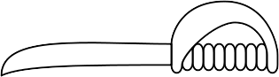

# OnEdge &nbsp; 

OnEdge is a library for detecting certain improper uses of the
[Defer, Panic, and Recover](https://blog.golang.org/defer-panic-and-recover) pattern in Go programs.
OnEdge is lightweight in that it is easy to incorporate into your project and tries to stay out of your
way as much as possible.

## What sort of problems does OnEdge detect?

OnEdge detects global state changes that occur between (1) the entry point to a function that `defer`s a
call to `recover` and (2) the point at which `recover` is called.  Often, such global state changes are
unintentional, e.g., the programmer didn't realize that code executed before a `panic` could have a
lasting effect on their program's behavior.

## How does OnEdge work?

OnEdge reduces the problem of finding such global state changes to one of race detection.  When the
program enters a function that `defer`s a call to `recover`, OnEdge launches a _shadow thread_.  If that
function later `panic`s, then the function is re-executed in the shadow thread.  If doing so causes the
shadow thread to make a global state change before calling `recover`, then that change appears as a data
race and can be reported by [Go's race detector](https://golang.org/doc/articles/race_detector.html).

When Go's race detector is disabled, OnEdge does nothing.

## Limitations

1. OnEdge is a dynamic analysis, and like all dynamic analyses, its effectiveness depends upon the
workload to which you subject your program.  In other words, for OnEdge to detect some global state
change, you must provide inputs to your program that cause it to make that global state change.

2. For some programs, OnEdge's results are non-deterministic, i.e., OnEdge could report a global state
change for some runs of the program, but not for others.  We believe this is because
[ThreadSanitizer](https://github.com/google/sanitizers) (on which Go's race detector is built) is itself
non-deterministic.

3. OnEdge is not currently thread safe.  For now, you should not, e.g., call `WrapFunc` from two
separate threads.

4. If your program is multithreaded, then use of OnEdge may cause spurious data races to be reported.
If you think that your program may contain a legitimate data race, then we recommend that you deal with
that before enabling OnEdge.  Further investigation into this issue is needed.

## Incorporating OnEdge into your project

To incorporate OnEdge into your project, you must do three things:

1. Wrap function bodies that `defer` calls to `recover` in `onedge.WrapFunc(func() {` ... `})`.

2. Within those wrapped function bodies, wrap calls to `recover` in `onedge.WrapRecover(` ... `)`.

3. Run your program with Go's race detector
[enabled](https://golang.org/doc/articles/race_detector.html#Usage), e.g., `go run -race mysrc.go`.

A function to which steps 1 and 2 have been applied might look something like this:
```go
func handle(request Request) {
    onedge.WrapFunc(func() {
        defer func() {
            if r := onedge.WrapRecover(recover()); r != nil {
                log.Println(r)
            }
        }()
        ...
        // Panicky code that potentially modifies global state
        ...
    })
}
```

Step 3 will cause data races to be reported for global state changes that occur:
* after entry to a function body wrapped by `WrapFunc`
* but before a `recover` wrapped by `WrapRecover`.

An example can be found in the [example](example) subdirectory.

Note that while global state changes in the shadow thread are reported, they still occur.  Be aware that
if, say, those changes have external effects (e.g., a write to a database on an external machine), then
those effects happen _twice_: once via the main thread and once via the shadow thread.  (Of course, this
is exactly the sort of problem that OnEdge is meant to detect.)

## Testing OnEdge

OnEdge itself can be tested in two ways:
* `make basic_test` performs a set of basic tests.
* `make nested_test` tests nested uses of `WrapFunc`.  This test is expensive as it performs a 2^22
exhaust.  On a MacBook Pro, this test takes the better part of a work day to run.

## Scripts

The [scripts](scripts) subdirectory contains some experimental scripts for filtering the Go race
detector's output.

## References

* Andrew Gerrand. [Defer, Panic, and Recover](https://blog.golang.org/defer-panic-and-recover). The Go Blog, 4 August 2010.

* The Go Authors. [Data Race Detector](https://golang.org/doc/articles/race_detector.html).

* Google. [AddressSanitizer, ThreadSanitizer, MemorySanitizer](https://github.com/google/sanitizers).

* Kavya Joshi. [Looking inside a Race Detector](https://www.infoq.com/presentations/go-race-detector). QCon, 10 March 2017.

* Dmitry Vyukov and Andrew Gerrand. [Introducing the Go Race Detector](https://blog.golang.org/race-detector). The Go Blog, 26 June 2013.

## License

The code in this repository is licensed under the [Apache 2.0 license](LICENSE).

